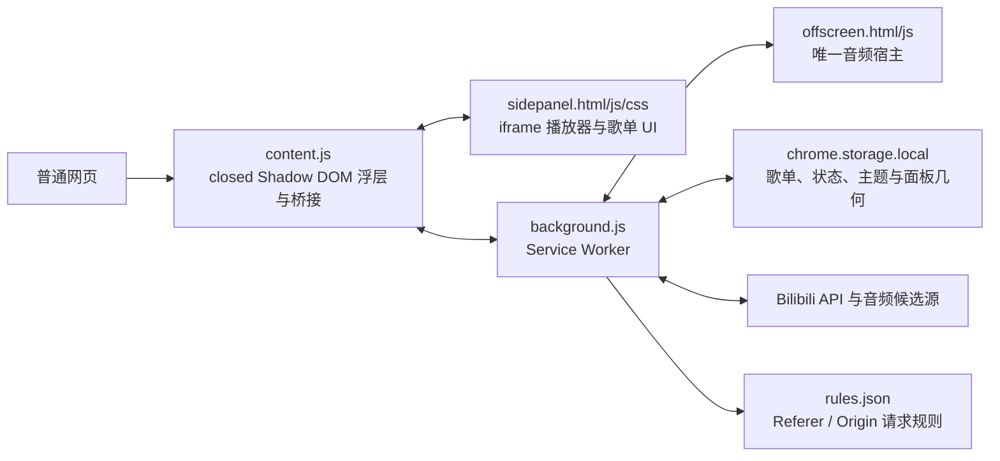

# 架构说明

## 仓库目录

```text
.
├── .github/            # CI、Issue 表单与 Pull Request 模板
├── docs/               # 面向维护者的设计文档
├── icons/              # Chrome 扩展图标
├── scripts/            # 确定性发布脚本
├── tests/              # 无浏览器依赖的 Node 测试
├── CHANGELOG.md        # 自首次公开发布起的正式版本记录
├── USER_GUIDE.md       # 随发布包提供的最终用户指南
├── manifest.json       # Manifest V3 入口
├── background.js       # Service Worker
├── offscreen.*         # 后台音频宿主
├── content.js          # 页面浮层与消息桥接
├── sidepanel.*         # 播放器与歌单界面
├── theme.js            # 主题定义
├── logger.js           # 运行日志
└── rules.json          # Declarative Net Request 规则
```

扩展运行文件有意保留在仓库根目录：`manifest.json` 和各 HTML 文件直接引用这些路径，浏览器也会直接加载源码。将它们机械搬入 `src/` 会引入一套当前并不需要的构建流程，因此协作与维护文件单独分入 `.github/`、`docs/`、`scripts/` 和 `tests/` 即可。

## 运行时分层



`offscreen.js` 是唯一允许创建和控制 `<audio>` 的模块。所有播放命令都经由 `sidepanel -> content -> background -> offscreen` 路由；状态和进度沿相反方向广播回 UI。不要在 content script 或 iframe 中增加备用音频引擎。

## 模块职责

| 路径 | 职责 |
| --- | --- |
| `manifest.json` | 权限、内容脚本、offscreen 资源、命令和可访问资源清单。 |
| `background.js` | 歌单与状态持久化、Bilibili 元数据和音频源解析、offscreen 生命周期与命令转发。 |
| `offscreen.html` / `offscreen-boot.js` / `offscreen.js` | 独立音频播放、候选源容错、MediaSession、进度和状态广播。 |
| `content.js` | 网页内 closed Shadow DOM 胶囊/浮动面板、拖拽缩放、iframe 消息桥接。 |
| `sidepanel.html` / `sidepanel.js` / `sidepanel.css` | iframe 中的播放器、歌单和交互视图。 |
| `theme.js` | 所有固定主题的语义 CSS 变量和主题迁移。 |
| `logger.js` | 内存缓冲、批量落盘和无存储上下文的日志中继。 |
| `rules.json` | Declarative Net Request 请求头规则。 |
| `tests/` | 直接加载真实源码的 Node mock 测试。 |
| `scripts/package.ps1` | 复跑测试、复制最小运行时文件、校验 SHA-256 并生成版本化 ZIP。 |

## 消息边界

iframe 不能直接依赖 `chrome.runtime.sendMessage`。`sidepanel.js` 使用 `window.postMessage` 将请求交给宿主页的 `content.js`，再由后者调用扩展 API。桥接时必须校验 `event.origin`，并保持请求 ID 与响应 ID 一一对应。

`background.js` 与 `offscreen.js` 优先使用长连接 Port。offscreen 收到命令后立即 ACK；Port 未及时 ACK 时，background 主动断开陈旧连接，并以相同 `_requestId` 经 `runtime.sendMessage` 重发。offscreen 同时缓存进行中请求和近期完成结果，因此跨通道重发不会重复执行播放命令。短消息只承担单条命令的传输降级，不改变“offscreen 是唯一音频宿主”的业务边界。

播放/切歌命令和音量、进度、模式等快速控制分别使用 28s 与 7s 的后台预算。它们不经过全局串行队列；offscreen 用单调递增的播放意图取消旧取源、旧媒体请求和旧 Blob 结果，保证最后一次用户操作获胜。B站 API、媒体 fetch、Blob 读取和 `audio.play()` 另有局部超时，外层播放流程总预算为 25s。

通信异常只允许在本条命令中重建 offscreen 一次，并受 10s 冷却保护。播放途中出现 `audio.error` 或长期 `stalled` 时，offscreen 会重新解析候选源、从当前断点有限重试；短暂卡流自行恢复会取消排队任务，三次恢复仍失败则停止播放并广播 `playerError`。

## 本地检查与发布

```bash
npm test
```

```powershell
npm run package:windows
```

GitHub Actions 会在推送到 `main` 和每个 Pull Request 上运行同一套语法检查与 Node 测试。发布包由 PowerShell 脚本生成，产物位于项目同级的 `release/` 目录，不进入源码仓库。
