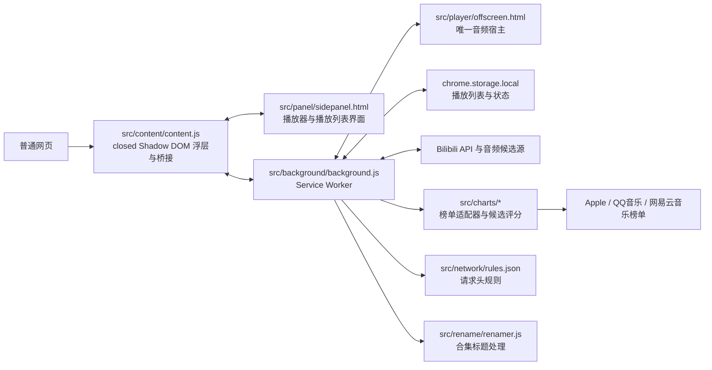

# 架构说明

## 仓库目录

```text
.
├── manifest.json              # Manifest V3 入口，必须位于根目录
├── update.bat                 # Windows 用户更新入口
├── README.md                  # 项目简介
├── LICENSE                    # GPL-3.0-or-later
├── CHANGELOG.md               # 正式版本记录
├── CONTRIBUTING.md            # 贡献指南
├── SECURITY.md                # 安全问题报告说明
├── package.json               # 本地检查、测试和打包命令
│
├── src/                       # 扩展运行时代码和静态配置
│   ├── background/
│   │   └── background.js      # Service Worker
│   ├── content/
│   │   └── content.js         # 页面浮层和消息桥
│   ├── charts/                 # 热榜导入与B站候选匹配
│   │   ├── apple.js            # Apple Music 榜单适配器
│   │   ├── qq.js               # QQ 音乐榜单适配器
│   │   ├── netease.js          # 网易云音乐榜单适配器
│   │   ├── matcher.js          # B站搜索候选通用评分
│   │   └── chart-picker.*      # 平台、分类、榜单和数量选择窗口
│   ├── player/
│   │   ├── offscreen.html
│   │   ├── offscreen-boot.js
│   │   └── offscreen.js       # 唯一音频宿主
│   ├── panel/
│   │   ├── sidepanel.html
│   │   ├── sidepanel.css
│   │   └── sidepanel.js       # 播放器和播放列表界面
│   ├── shared/
│   │   ├── logger.js
│   │   └── theme.js            # 跨上下文共享模块
│   ├── network/
│   │   └── rules.json          # declarativeNetRequest 请求规则
│   └── rename/                 # 合集标题智能重命名模块
│       ├── renamer.js          # 默认算法、规则校验和静态规则加载
│       └── rules.json          # 可选的静态正则替换规则
│
├── assets/icons/              # 扩展图标
├── docs/                      # 维护者文档和用户指南
├── tests/                     # 无浏览器依赖的 Node 测试
├── scripts/                   # 发布与更新脚本
│   ├── package.ps1            # 生成最小发布包和 SHA-256 文件
│   └── update.ps1             # 下载、校验和部署完整更新包
└── .github/                   # CI、Issue 和 PR 模板
```

运行时代码没有使用打包器。Manifest 可以直接引用 `src/` 下的 JavaScript、HTML、CSS 和 JSON 文件，因此目录整理不会改变运行方式，只需要同步更新资源路径。

## 运行时分层



`src/player/offscreen.js` 是唯一允许创建和控制 `<audio>` 的模块。播放命令经过 `sidepanel -> content -> background -> offscreen` 路由，状态和进度沿相反方向广播回界面。不要在内容脚本或 iframe 中增加备用音频引擎。

列表修改使用 `playlistId` 和稳定条目 ID，不能依赖执行时的活动列表或旧下标。后台播放意图从收到用户命令时开始记录；旧匹配完成后只在意图仍有效时触发播放。持久播放状态由 background 串行合并字段补丁，offscreen 不自行读改写整份状态。offscreen 只支持 runtime 扩展 API，存储代理是正常运行路径。

手动匹配通过 offscreen 中临时的静音媒体元素验证起播，验证结束即清理，不影响唯一有声播放器。验证失败不会先覆盖原来源；网络超时等暂态失败保留旧源并结束本次操作。

## 模块职责

| 路径 | 职责 |
| --- | --- |
| `manifest.json` | 权限、脚本入口、offscreen 资源、可访问资源和网络规则清单。 |
| `src/background/background.js` | 播放列表与状态持久化、Bilibili 元数据/合集/音频源解析、offscreen 生命周期和命令转发。 |
| `src/player/` | 独立音频播放、候选源容错、MediaSession、进度和状态广播。 |
| `src/content/content.js` | 页面浮动入口、播放器外壳、合集确认交互、拖拽缩放和 iframe 消息桥接。 |
| `src/charts/` | 第三方榜单目录与响应归一化、榜单选择窗口，以及 B站搜索候选通用评分。 |
| `src/panel/` | 播放器、播放列表管理、导入导出和用户交互界面。 |
| `src/shared/theme.js` | 固定主题的语义 CSS 变量和主题迁移。 |
| `src/shared/logger.js` | 跨上下文日志缓冲、落盘和日志中继。 |
| `src/network/rules.json` | Bilibili 媒体请求所需的 Referer / Origin 规则。 |
| `src/rename/` | 合集标题智能重命名；默认逻辑在 JavaScript 中，用户规则只允许使用经过校验的静态 JSON。 |
| `tests/` | 直接加载真实源码的 Node mock 测试。 |
| `update.bat` | Windows 用户双击后启动更新脚本。 |
| `scripts/package.ps1` | 运行测试、复制最小运行时文件、校验并生成版本化 ZIP 与 SHA-256 文件。 |
| `scripts/update.ps1` | 从官方 GitHub Release 下载完整包，校验后部署并在失败时回滚。 |

## 路径和配置边界

面板确认及名称输入使用 iframe 内的 HTML `dialog`，不调用浏览器原生 `confirm`、`prompt` 或 `alert`。删除命令携带确认时的列表 ID、名称及条目 ID/标题快照，后台在列表写入锁内校验并执行。批量删除必须完整匹配所选条目；清空或删除列表必须匹配列表全部条目。排序、播放进度等无关变化不影响确认，目标变化或缺少快照则拒绝操作，要求用户重新确认。

所有扩展内部路径都以扩展根目录为基准：Manifest 使用 `src/...` 路径，HTML 使用相对于自身目录的路径，Service Worker 使用 `chrome.runtime.getURL()` 或扩展根相对路径。

网络规则和标题规则必须位于不同模块目录。重命名模块只读取经过校验的静态 JSON，不执行用户上传的 JavaScript、HTML 或动态模块，也不从远程地址加载配置。空规则文件或单条规则无效时，内置默认逻辑仍然生效。

榜单适配器采用统一接口：`catalog()` 返回“平台 → 分类 → 榜单”目录，`fetchChart(chartId, fetchJson, { limit })` 只返回 `rank`、`title` 和 `artist`。第三方平台的封面、歌曲 ID、音频地址和播放链接不得写入播放列表；BVID、CID、封面、时长和 UP 主只能来自 B站匹配结果。

## 智能重命名

合集确认弹窗中的“智能重命名”只对当前一次导入生效。后台复制合集条目后，重命名模块按以下顺序处理：应用已启用的静态正则替换、分割标题、移除明确的前缀元数据、删除超过十个字符的可疑片段、批量识别公共前缀和后缀、重组最终标题，最后追加用户输入的统一前缀。长片段不会修改原对象；导入完成后只保存 `title`，原始标题不写入播放列表。

`rules.json` 使用合法 JSON，示例通过 `enabled: false` 禁用。支持 `scope`（`title` 或 `segment`）、`pattern`、`flags`（`g`、`i`、`m`）和 `replace` 字段。空规则或无效规则不影响默认命名。

用户正则采用有计算上限的语法子集：普通字符、`.`、字符集/范围、`^`/`$`、`|`、非捕获组 `(?:...)`，以及单字符原子的贪婪量词 `? * + {n} {n,m} {n,}`。支持常见字符转义和 `\xHH`/`\uHHHH`（写入 JSON 时反斜杠需转义）；不支持捕获组、分组量词、反向引用、前后查找、词边界和懒惰量词。替换可使用普通文本、`$$`、`$&` 及前后文标记，`$1` 作为文字保留。

实现只用原生 RegExp 判断单个字符，将完整规则编译为最多 512 个状态的匹配图，对状态和字符位置进行记忆。每条目的全部自定义规则共用 25,000 步预算，每次替换的输入与结果最多 240 个 UTF-16 字符。超出语法或预算的规则被跳过，因此不会因灾难性回溯阻塞后台。

## 合集导入

合集导入保持“页面交互、后台持有数据”的边界：内容脚本从当前视频地址提取 BVID，后台请求 Bilibili view API 并展开分区、剧集和分 P。非嵌套条目使用分 P 名称；只有合集内的视频自身包含多个分 P 时，才使用“视频标题 · 分 P 名称”避免重名。完整条目缓存在 Service Worker 中，确认后由后台一次性去重和写入播放列表。

## 热榜导入与渐进匹配

榜单窗口只提交来源、榜单 ID、导入数量和播放列表名称。后台调用对应适配器并创建仅含排名、歌曲名和歌手名的占位播放列表；显示标题固定为“歌曲名 - 歌手”。开始播放后，后台按列表顺序间隔预匹配后续条目；实际播放顺序优先，随机模式选中待匹配条目时会立即匹配该条目。

导入请求的同步边界是“榜单读取、占位条目生成、一次批量写入和数据广播”。它不会等待 B站搜索或音频流验证完成。窗口为一次导入提供稳定请求 ID，超时重试复用后台任务或已保存的列表；新发起的导入使用新 ID。网络准备及重命名计算在列表写入锁外执行，提交时重新读取列表并校验目标。

B站搜索接口返回 HTTP 412 时，搜索层单独进行最多四次请求（初次请求加 1.5、3、6 秒退避）；用户触发匹配时，候选不能解析或媒体确实不可用，则重新搜索并排除本次失败候选，最多十轮，并限制操作时间。瞬时网络故障不会持续尝试不同来源。匹配、音源解析、媒体起播分阶段计时，上层消息等待长于下层操作；停止和新点播使旧播放意图失效。

自动匹配使用 B站视频搜索的前 10 个结果，按歌曲名、歌手、时长、正负关键词进行通用评分。用户手动点击待匹配或失败条目时使用前 30 个结果和较宽松阈值。成功后只写入 B站播放元数据，不用 B站原标题覆盖热榜标题；失败条目自动跳过，手动点击仍可重试。所有推进循环均限制尝试次数，避免网络失败或整榜匹配失败时无限请求。

## 本地检查与发布

```bash
npm test
```

```powershell
npm run package:windows
```

发布脚本只复制扩展运行时文件、图标、许可证和用户指南到项目外的 `release/` 目录，不会把测试、文档源码或构建产物写回仓库。

Windows 上运行 `npm run test:update` 验证打包、升级和故障恢复。发布脚本与更新器复用 `update.ps1 -ValidateOnly` 检查 Manifest、HTML、静态脚本及样式依赖。输出目录不得与源码重叠，Git 检出目录不能被发布包更新器替换。安装通过检查后即提交，清理备份失败只警告；部署失败则尝试恢复并报告实际结果。

更新器由旧安装启动，后台路径、规则路径和 ZIP/SHA 命名属于升级兼容约定。未来改变目录或用户规则格式，应先提供过渡版本或明确要求手动升级，不能只修改新包内脚本。
